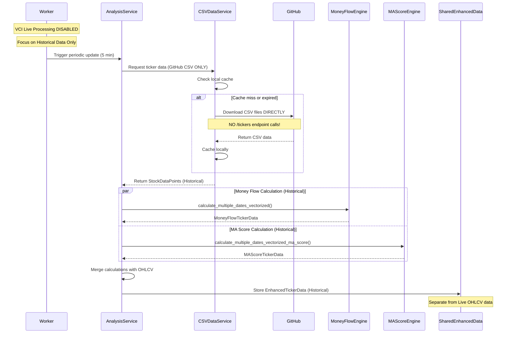
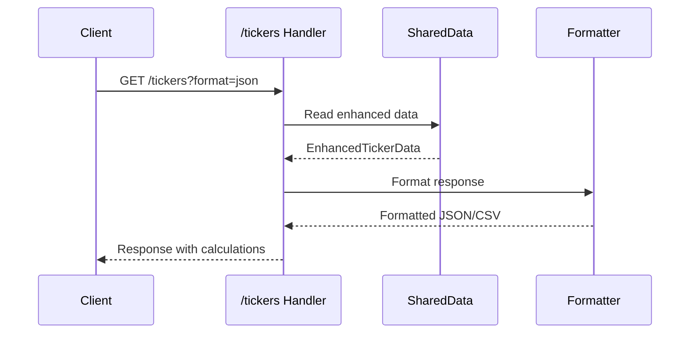

# CLI Module Integration Plan for Enhanced /tickers API

## Executive Summary
This document outlines the integration of the CLI module's analytical capabilities into the existing `/tickers` API endpoint to provide pre-calculated money flow and MA score values alongside OHLCV data, eliminating the need for client-side calculations.

## ⚠️ CRITICAL ARCHITECTURAL ISSUE IDENTIFIED

### Circular Dependency Problem
**ISSUE**: The CLI module is currently configured to fetch data from `api.aipriceaction.com/tickers` - which is actually THIS SAME SERVER we're trying to enhance! This creates a circular dependency where:

1. CLI tries to fetch from `/tickers` endpoint
2. `/tickers` endpoint tries to use CLI for calculations
3. CLI waits for `/tickers` response → **DEADLOCK**

### Resolution Strategy
**SOLUTION**: CLI must use **GitHub CSV files directly** as the primary data source for historical data, NOT the `/tickers` endpoint.

### Immediate Action Plan
1. **Phase 1**: ✅ Disable VCI live processing (DONE)
2. **Phase 2**: 🔄 Update CLI configuration to use GitHub CSV directly
3. **Phase 3**: 🔄 Integrate CLI analysis into background worker
4. **Phase 4**: 🔄 Enhance /tickers API to serve calculated data
5. **Phase 5**: ⏳ Re-enable VCI for live updates (FUTURE)

## Current Architecture Analysis

### Existing System
- **API Endpoint**: `/tickers` returns raw OHLCV data
- **Data Source**: VCI live API (3rd party) - **TEMPORARILY DISABLED**
- **Data Structure**: `OhlcvData` with time, open, high, low, close, volume fields
- **Response Format**: JSON object with ticker symbols as keys and arrays of data points

### CLI Module Capabilities (CORRECTED)
- **CSV Data Service**: Downloads and caches market data **DIRECTLY FROM GITHUB** (not from /tickers!)
- **Money Flow Engine**: Vectorized calculations for money flow analysis
- **MA Score Engine**: Moving average scoring across multiple periods (MA10, MA20, MA50)
- **Performance**: High-speed matrix operations using Rust's rayon for parallelization

## Integration Architecture

### Component Overview
```
┌─────────────────────────────────────────────────────────┐
│                   aipriceaction-proxy                    │
├─────────────────────────────────────────────────────────┤
│                                                          │
│  ┌──────────────┐  ┌──────────────┐  ┌──────────────┐ │
│  │   Worker     │  │   API        │  │   Main       │ │
│  │   Module     │  │   Handler    │  │   Server     │ │
│  └──────┬───────┘  └──────┬───────┘  └──────────────┘ │
│         │                  │                            │
│         ▼                  ▼                            │
│  ┌──────────────────────────────────────┐              │
│  │        Analysis Service              │              │
│  │  ┌────────────┐  ┌────────────┐    │              │
│  │  │ CSV Service│  │ Calculators│    │              │
│  │  └────────────┘  └────────────┘    │              │
│  └──────────────────────────────────────┘              │
│         │                                               │
│         ▼                                               │
│  ┌──────────────────────────────────────┐              │
│  │          SharedData Storage          │              │
│  │    Enhanced with Calculated Values   │              │
│  └──────────────────────────────────────┘              │
│                                                          │
├─────────────────────────────────────────────────────────┤
│                     CLI Module                           │
│  ┌────────────┐  ┌────────────┐  ┌────────────┐       │
│  │CSV Service │  │Money Flow  │  │  MA Score  │       │
│  │            │  │  Engine    │  │   Engine   │       │
│  └────────────┘  └────────────┘  └────────────┘       │
└─────────────────────────────────────────────────────────┘
```

## Data Flow Architecture (CORRECTED)

### 1. Background Data Processing - HISTORICAL ONLY


### 2. API Request Handling


## Implementation Details

### Phase 1: Foundation Setup

#### 1.1 Add CLI Module Dependency
**File**: `Cargo.toml`
```toml
[dependencies]
# Existing dependencies...
aipriceaction = { path = "./cli" }
```

#### 1.2 Create Enhanced Data Structure
**File**: `src/data_structures.rs`
```rust
use serde::{Deserialize, Serialize};

#[derive(Debug, Clone, Serialize, Deserialize)]
pub struct EnhancedTickerData {
    // Core OHLCV data
    pub date: String,           // YYYY-MM-DD format
    pub open: f64,
    pub high: f64,
    pub low: f64,
    pub close: f64,
    pub volume: i64,

    // Moving averages
    pub ma10: Option<f64>,
    pub ma20: Option<f64>,
    pub ma50: Option<f64>,

    // Money flow metrics
    #[serde(rename = "moneyFlow")]
    pub money_flow: Option<f64>,  // Percentage
    pub af: Option<f64>,          // Activity flow
    pub df: Option<f64>,          // Dollar flow
    pub ts: Option<f64>,          // Trend score

    // MA scores (percentage deviation from MA)
    pub score10: Option<f64>,
    pub score20: Option<f64>,
    pub score50: Option<f64>,
}

// Response metadata
#[derive(Debug, Serialize, Deserialize)]
pub struct TickerResponseMeta {
    pub timestamp: String,
    pub calculated: bool,
    #[serde(skip_serializing_if = "Option::is_none")]
    pub error: Option<bool>,
}

// Complete API response structure
#[derive(Debug, Serialize, Deserialize)]
pub struct EnhancedTickerResponse {
    #[serde(rename = "_meta")]
    pub meta: TickerResponseMeta,
    #[serde(flatten)]
    pub data: HashMap<String, Vec<EnhancedTickerData>>,
}
```

### Phase 2: Analysis Service Implementation

#### 2.1 Create Analysis Service Module
**File**: `src/analysis_service.rs`
```rust
use aipriceaction::{
    prelude::*,
    services::csv_service::CSVDataService,
    utils::vectorized_money_flow::calculate_multiple_dates_vectorized,
    utils::vectorized_ma_score::calculate_multiple_dates_vectorized_ma_score,
};
use std::collections::HashMap;
use std::sync::Arc;
use tokio::sync::Mutex;

pub struct AnalysisService {
    csv_service: CSVDataService,
    last_update: Arc<Mutex<Option<chrono::DateTime<chrono::Utc>>>>,
}

impl AnalysisService {
    pub fn new() -> Result<Self, Box<dyn std::error::Error>> {
        Ok(Self {
            csv_service: CSVDataService::new()?,
            last_update: Arc::new(Mutex::new(None)),
        })
    }

    pub async fn fetch_and_calculate(
        &self,
        tickers: Vec<String>,
        date_range: DateRangeConfig,
    ) -> Result<HashMap<String, Vec<EnhancedTickerData>>, Box<dyn std::error::Error>> {
        // 1. Fetch CSV data from GitHub
        let ticker_data = self.csv_service.fetch_tickers(&tickers, &date_range).await?;

        // 2. Prepare date range for calculations
        let dates = self.extract_date_range(&ticker_data);

        // 3. Calculate money flow
        let money_flow_result = calculate_multiple_dates_vectorized(
            &ticker_data,
            &tickers,
            &dates,
            None, // VNINDEX data if needed
            false, // vnindex_volume_weighting
            true,  // directional_colors
        );

        // 4. Calculate MA scores
        let ma_config = MAScoreProcessConfig {
            date_range_config: date_range.clone(),
            days_back: dates.len(),
            current_date: None,
            default_ma_period: 20,
        };

        let (ma_scores, _metrics) = calculate_multiple_dates_vectorized_ma_score(
            &ticker_data,
            &tickers,
            &dates,
            &ma_config,
        );

        // 5. Merge all data into enhanced structure
        self.merge_calculations(ticker_data, money_flow_result, ma_scores)
    }

    fn merge_calculations(
        &self,
        ohlcv: HashMap<String, Vec<StockDataPoint>>,
        money_flow: MultipleDatesResult,
        ma_scores: HashMap<String, Vec<MAScoreTickerData>>,
    ) -> Result<HashMap<String, Vec<EnhancedTickerData>>, Box<dyn std::error::Error>> {
        // Implementation to merge OHLCV with calculations
        // Convert to EnhancedTickerData format
    }
}
```

### Phase 3: Worker Integration

#### 3.1 Modify Worker Module
**File**: `src/worker.rs`
```rust
// Add to existing worker module

use crate::analysis_service::AnalysisService;

async fn update_calculated_data(
    shared_data: SharedData,
    analysis_service: Arc<AnalysisService>,
) -> Result<(), Box<dyn std::error::Error>> {
    // Get current tickers from shared data
    let tickers = {
        let data = shared_data.lock().await;
        data.keys().cloned().collect::<Vec<_>>()
    };

    // Define date range (e.g., last 60 days)
    let date_range = DateRangeConfig::new(TimeRange::TwoMonths);

    // Fetch and calculate
    let enhanced_data = analysis_service
        .fetch_and_calculate(tickers, date_range)
        .await?;

    // Update shared data with enhanced values
    {
        let mut data = shared_data.lock().await;
        // Merge enhanced_data into existing data structure
        // Preserve existing OHLCV while adding calculations
    }

    Ok(())
}

// Add periodic task in main worker loop
pub async fn run(
    shared_data: SharedData,
    app_config: AppConfig,
    shared_health_stats: SharedHealthStats,
) {
    let analysis_service = Arc::new(AnalysisService::new().unwrap());

    loop {
        // Existing worker logic...

        // Add calculation update every 5 minutes
        if should_update_calculations() {
            if let Err(e) = update_calculated_data(
                shared_data.clone(),
                analysis_service.clone()
            ).await {
                tracing::error!("Failed to update calculations: {}", e);
            }
        }

        // Continue with existing logic...
    }
}
```

### Phase 4: API Enhancement

#### 4.1 Update Query Parameters
**File**: `src/api.rs`
```rust
#[derive(Debug, Deserialize)]
pub struct TickerParams {
    symbol: Option<Vec<String>>,
    start_date: Option<String>,
    end_date: Option<String>,
    all: Option<bool>,
    format: Option<String>,  // "json" or "csv"
}
```

#### 4.2 Modify API Handler
**File**: `src/api.rs`
```rust
pub async fn get_all_tickers_handler(
    State(state): State<SharedData>,
    Query(params): Query<TickerParams>
) -> impl IntoResponse {
    // Existing parameter parsing...

    let format = params.format.as_deref().unwrap_or("json");

    // Get enhanced data from SharedData
    let enhanced_data = get_enhanced_ticker_data(&state, &params).await;

    match format {
        "csv" => {
            // Format as CSV for large datasets
            let csv_content = format_as_csv(enhanced_data);
            (
                StatusCode::OK,
                [(header::CONTENT_TYPE, "text/csv")],
                csv_content,
            ).into_response()
        }
        _ => {
            // Default JSON format with metadata
            let response = EnhancedTickerResponse {
                meta: TickerResponseMeta {
                    timestamp: chrono::Utc::now().to_rfc3339(),
                    calculated: true,
                    error: None,
                },
                data: enhanced_data,
            };

            (
                StatusCode::OK,
                [(header::CONTENT_TYPE, "application/json")],
                Json(response),
            ).into_response()
        }
    }
}
```

### Phase 5: CSV Format Support

#### 5.1 CSV Formatter Implementation
```rust
fn format_as_csv(data: HashMap<String, Vec<EnhancedTickerData>>) -> String {
    let mut csv_writer = csv::Writer::from_writer(vec![]);

    // Write header
    csv_writer.write_record(&[
        "date", "symbol", "close", "volume",
        "ma10", "ma20", "ma50",
        "moneyFlow", "af", "df", "ts",
        "score10", "score20", "score50"
    ]).unwrap();

    // Write data rows
    for (symbol, ticker_data) in data {
        for point in ticker_data {
            csv_writer.write_record(&[
                &point.date,
                &symbol,
                &point.close.to_string(),
                &point.volume.to_string(),
                &format_optional(point.ma10),
                &format_optional(point.ma20),
                &format_optional(point.ma50),
                &format_optional(point.money_flow),
                &format_optional(point.af),
                &format_optional(point.df),
                &format_optional(point.ts),
                &format_optional(point.score10),
                &format_optional(point.score20),
                &format_optional(point.score50),
            ]).unwrap();
        }
    }

    String::from_utf8(csv_writer.into_inner().unwrap()).unwrap()
}
```

## Performance Considerations

### Caching Strategy
1. **CSV File Cache**: 1-hour expiry in `/tmp/aipriceaction_cli_cache/`
2. **Calculated Values Cache**: Store in SharedData, refresh every 5 minutes
3. **Memory Management**: Use streaming for CSV format to handle large datasets

### Optimization Techniques
1. **Vectorized Calculations**: Leverage CLI's matrix operations
2. **Parallel Processing**: Use rayon for concurrent ticker processing
3. **Lazy Evaluation**: Calculate only requested tickers and date ranges
4. **Format Selection**: Automatic selection based on data size

### Resource Usage Estimates
- **Memory**: ~50-100MB for 200 tickers with 60 days of data
- **CPU**: Spike during calculation (~2-3 seconds for full dataset)
- **Network**: ~5-10MB download from GitHub per update
- **Disk**: ~20-30MB cache storage

## Error Handling

### Failure Scenarios
1. **GitHub Unavailable**: Fall back to cached data or existing OHLCV
2. **Calculation Errors**: Log error, return partial data with error flag
3. **Memory Constraints**: Implement streaming for large responses
4. **Invalid Parameters**: Return 400 with descriptive error message

### Error Response Format
```json
{
  "_meta": {
    "timestamp": "2025-09-25T15:30:00Z",
    "calculated": false,
    "error": true
  },
  "error": {
    "code": "CALCULATION_FAILED",
    "message": "Unable to calculate values for requested tickers",
    "details": {
      "failed_tickers": ["INVALID"],
      "partial_data_available": true
    }
  },
  "data": {
    "VCB": [...] // Partial data if available
  }
}
```

## Testing Strategy

### Unit Tests
1. **Data Structure Serialization**: Verify JSON/CSV format correctness
2. **Calculation Accuracy**: Compare with known results
3. **Cache Behavior**: Test expiry and refresh logic
4. **Error Handling**: Verify graceful degradation

### Integration Tests
1. **End-to-End Flow**: From CSV fetch to API response
2. **Format Switching**: JSON vs CSV based on parameters
3. **Performance**: Large dataset handling (200+ tickers, 365 days)
4. **Concurrent Requests**: Thread safety and data consistency

### Performance Benchmarks
- **Target**: < 100ms response time for cached data
- **Calculation Time**: < 3 seconds for full dataset refresh
- **Memory Usage**: < 100MB increase from baseline
- **CSV Streaming**: Handle 1GB+ responses without OOM

## Migration Plan

### Phase 1: Development (Week 1)
- [ ] Add CLI module dependency
- [ ] Create enhanced data structures
- [ ] Implement analysis service
- [ ] Unit test core functionality

### Phase 2: Integration (Week 2)
- [ ] Integrate with worker module
- [ ] Modify API handler
- [ ] Add CSV format support
- [ ] Integration testing

### Phase 3: Testing & Optimization (Week 3)
- [ ] Performance testing with production data
- [ ] Memory optimization
- [ ] Error handling improvements
- [ ] Documentation updates

### Phase 4: Deployment (Week 4)
- [ ] Staging environment testing
- [ ] Gradual rollout with feature flag
- [ ] Monitor performance metrics
- [ ] Full production deployment

## Rollback Strategy
1. **Feature Flag**: Environment variable to disable calculations
2. **Graceful Degradation**: Fall back to raw OHLCV if calculations fail
3. **Version Control**: Tag releases for quick rollback
4. **Data Compatibility**: Maintain backward compatibility with existing API

## Success Metrics
1. **Performance Improvement**: 40-60% reduction in client-side CPU usage
2. **Response Time**: < 100ms for cached requests
3. **Data Freshness**: Updates every 5 minutes during market hours
4. **Error Rate**: < 0.1% calculation failures
5. **Memory Efficiency**: < 20% increase in server memory usage

## Security Considerations
1. **Input Validation**: Sanitize ticker symbols and date ranges
2. **Rate Limiting**: Existing governor middleware applies
3. **Cache Security**: Temporary files with restricted permissions
4. **Data Integrity**: Validate CSV data from GitHub

## Documentation Updates
1. **API Documentation**: Update with new response format and parameters
2. **Migration Guide**: For existing API consumers
3. **Performance Guide**: Best practices for using enhanced API
4. **Troubleshooting**: Common issues and solutions

## Conclusion
This integration plan provides a comprehensive approach to enhancing the `/tickers` API with pre-calculated analytical values from the CLI module. The implementation maintains backward compatibility while significantly improving performance by eliminating client-side calculations. The phased approach ensures minimal risk with clear rollback strategies and success metrics.

## Appendix A: Sample API Responses

### JSON Format (Default)
```json
GET /tickers?symbol=VCB&symbol=FPT&start_date=2025-09-24&end_date=2025-09-25

{
  "_meta": {
    "timestamp": "2025-09-25T15:30:00Z",
    "calculated": true
  },
  "VCB": [
    {
      "date": "2025-09-24",
      "open": 62400.0,
      "high": 62700.0,
      "low": 61800.0,
      "close": 62700.0,
      "volume": 3879200,
      "ma10": 64200.0,
      "ma20": 65600.0,
      "ma50": 63700.0,
      "moneyFlow": 0.45,
      "af": 0.45,
      "df": 1.02,
      "ts": 0.86,
      "score10": -2.3,
      "score20": -4.4,
      "score50": -1.6
    },
    {
      "date": "2025-09-25",
      "open": 63300.0,
      "high": 63400.0,
      "low": 62700.0,
      "close": 63000.0,
      "volume": 3870300,
      "ma10": 63900.0,
      "ma20": 65500.0,
      "ma50": 63700.0,
      "moneyFlow": -0.08,
      "af": -0.08,
      "df": -0.19,
      "ts": 0.86,
      "score10": -1.4,
      "score20": -3.9,
      "score50": -1.1
    }
  ],
  "FPT": [
    {
      "date": "2025-09-25",
      "open": 124500.0,
      "high": 125500.0,
      "low": 124000.0,
      "close": 125000.0,
      "volume": 2156300,
      "ma10": 126200.0,
      "ma20": 127500.0,
      "ma50": 124800.0,
      "moneyFlow": 0.12,
      "af": 0.12,
      "df": 0.28,
      "ts": 0.91,
      "score10": -1.0,
      "score20": -1.9,
      "score50": 0.2
    }
  ]
}
```

### CSV Format
```csv
GET /tickers?format=csv&symbol=VCB&symbol=FPT&start_date=2025-09-24&end_date=2025-09-25

date,symbol,open,high,low,close,volume,ma10,ma20,ma50,moneyFlow,af,df,ts,score10,score20,score50
2025-09-24,VCB,62400,62700,61800,62700,3879200,64200,65600,63700,0.45,0.45,1.02,0.86,-2.3,-4.4,-1.6
2025-09-25,VCB,63300,63400,62700,63000,3870300,63900,65500,63700,-0.08,-0.08,-0.19,0.86,-1.4,-3.9,-1.1
2025-09-25,FPT,124500,125500,124000,125000,2156300,126200,127500,124800,0.12,0.12,0.28,0.91,-1.0,-1.9,0.2
```

## Appendix B: Configuration Options

### Environment Variables
```bash
# Enable/disable calculation features
ENABLE_CALCULATIONS=true

# Cache configuration
CACHE_DIR=/tmp/aipriceaction_cli_cache
CACHE_EXPIRY_SECONDS=3600

# Update intervals
CALCULATION_UPDATE_INTERVAL=300  # 5 minutes

# Performance tuning
MAX_PARALLEL_TICKERS=50
VECTORIZATION_BATCH_SIZE=100

# Feature flags
USE_CSV_STREAMING=true
ENABLE_RESPONSE_COMPRESSION=true
```

### Runtime Configuration
```rust
pub struct CalculationConfig {
    pub enabled: bool,
    pub update_interval: Duration,
    pub cache_expiry: Duration,
    pub max_parallel_tickers: usize,
    pub use_streaming: bool,
}
```